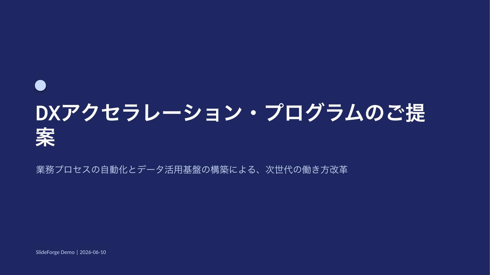
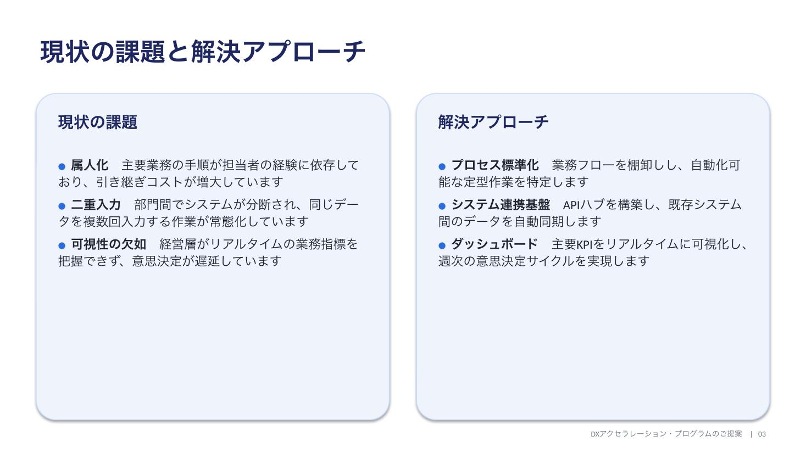
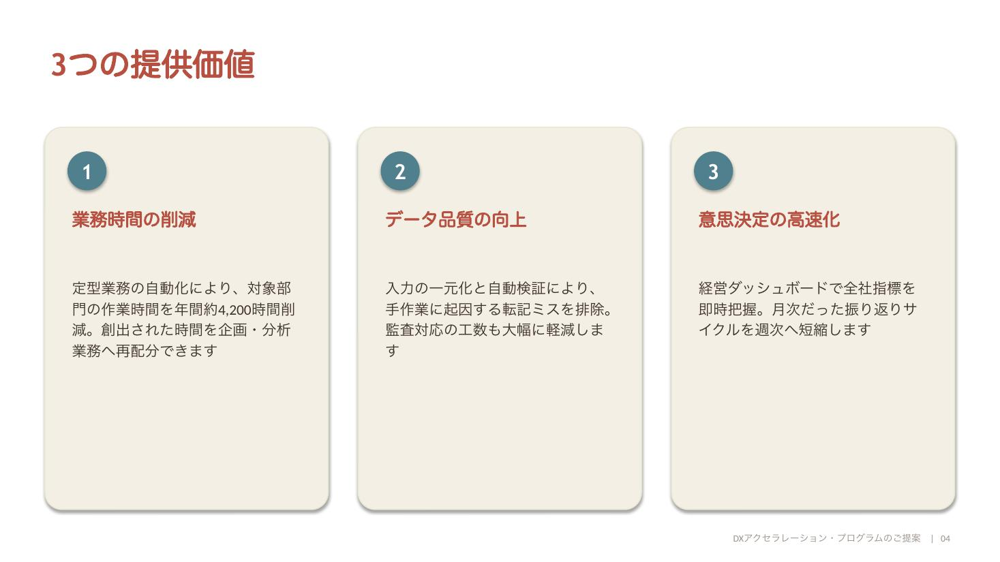
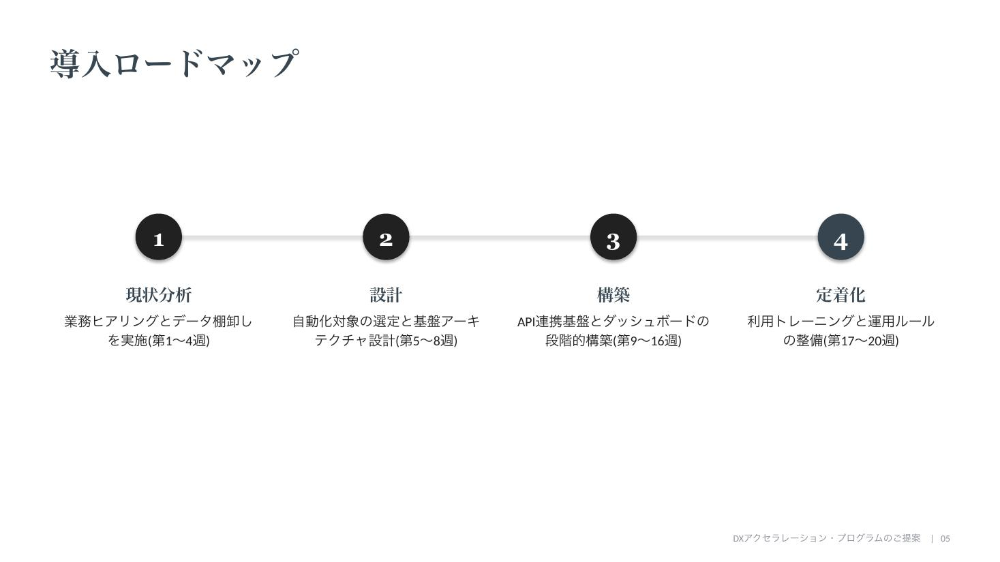

# SlideForge

**Markdown in, polished PowerPoint out.** SlideForge is a zero-config CLI that
turns plain Markdown into professional .pptx decks: it detects the structure of
each slide (two `##` headings → split layout, numbered list → timeline, three
bold-lead bullets → card grid), applies a color/font theme, and auto-shrinks
text so nothing ever overflows. Japanese typography is a first-class citizen —
themes resolve East-Asian fonts per target OS (Yu Gothic on Windows, Hiragino
on macOS).

```bash
pip install slideforge
slideforge proposal.md --all-themes -o output/
```

| | |
|---|---|
|  |  |
|  |  |

---

Markdown からプロクオリティの PowerPoint(.pptx)を自動生成する汎用 CLI ツールです。
見出し・箇条書き・番号リストの構造を解析し、**最適なレイアウトを自動選択**して、
テーマカラー・フォント・配置をすべて動的に計算します。

```
Markdown ──→ md_parser ──→ layout_engine ──→ renderer ──→ .pptx
                │               │                │
            構造解析       レイアウト判定      python-pptx
                          + 座標計算(Inches)  + Text Auto-fit
                          + フォント自動縮小
```

## インストール

Python 3.10+ が必要です。依存(python-pptx)は自動で入ります。

```bash
# PyPI 公開後
pip install slideforge

# GitHub から直接
pip install git+https://github.com/NagaYu/slideforge.git

# ローカル開発(クローン済みリポジトリで)
pip install -e .
```

インストールすると `slideforge` コマンドが使えるようになります。

## クイックスタート

```bash
# 同梱のサンプル提案書 Markdown を書き出す
slideforge --write-sample proposal.md

# 1テーマで生成
slideforge proposal.md --theme TechBlue -o proposal.pptx

# 全テーマ一括生成(テーマ比較に便利)
slideforge proposal.md --all-themes -o output/

# タイトルスライドにフッターを入れる
slideforge proposal.md -t WarmCreative --footer "Acme Inc. | 2026-06-10"

# 配布先が Windows 中心なら和文フォントを游ゴシック系で焼き込む
slideforge proposal.md --fonts win
```

## Markdown の書き方とレイアウト自動判定

スライドは `---` で区切ります。各スライドの内容から、以下のルールでレイアウトが
自動選択されます(`layout_engine.detect_layout`)。

| Markdown の構造 | 選択されるレイアウト |
|---|---|
| 最初のスライド(`#` + 本文テキスト) | **タイトルスライド**(ダーク背景・ステートメント型) |
| `##` 見出しが **2つ** | **左右分割レイアウト**(2カラムカード) |
| 番号付きリスト(`1.` `2.` …) | **ステップ・タイムライン**(番号サークル + 接続線) |
| `**太字リード:** 説明` 形式の箇条書きが **ちょうど3つ** | **3カラムカード型**(番号バッジ付きカード) |
| `#` のみで本文なし | **ステートメントスライド**(締めの挨拶など) |
| 上記以外 | **標準箇条書き**レイアウト |

箇条書きで `- **リード:** 本文` と書くと、リード部分が見出しフォント・太字で
強調されます。本文中の `**強調**` も太字ランとして反映されます。

### サンプル

```markdown
# 提案タイトル

サブタイトル(タイトルスライドの説明文になります)

---

# 現状の課題と解決アプローチ

## 現状の課題
- **属人化:** 手順が担当者の経験に依存
- **二重入力:** 部門間でデータが分断

## 解決アプローチ
- **標準化:** 業務フローを棚卸し
- **連携基盤:** API ハブでデータを自動同期

---

# 導入ロードマップ

1. **現状分析:** ヒアリングと棚卸し(第1〜4週)
2. **設計:** アーキテクチャ設計(第5〜8週)
3. **構築:** 段階的構築(第9〜16週)
```

## テーマ

| テーマ名 | 雰囲気 | 主要色 |
|---|---|---|
| `TechBlue` | テック / SaaS 提案向けの信頼感あるネイビー | ミッドナイトネイビー × エレクトリックブルー |
| `MinimalGray` | 役員向け資料などフォーマルなモノクローム | チャコール × ニアブラック(見出しはセリフ体) |
| `WarmCreative` | ブランド / クリエイティブ案件向けの温かみ | テラコッタ × サンド × スレートティール |

### 和文フォントとクロスプラットフォーム対応

.pptx には1ランにつき1書体しか記録できないため、テーマは和文フォントを
**論理名**(`gothic` / `round_gothic` / `mincho`)で持ち、生成時に
ターゲットOSの実フォントへ解決します(`--fonts auto|win|mac`)。

| 論理名 | `--fonts win`(Windows 標準) | `--fonts mac`(macOS 標準) |
|---|---|---|
| `gothic` | Yu Gothic(游ゴシック) | Hiragino Kaku Gothic ProN |
| `round_gothic` | Yu Gothic ※丸ゴ非搭載のため | Hiragino Maru Gothic ProN |
| `mincho` | Yu Mincho(游明朝) | Hiragino Mincho ProN |

既定の `auto` は生成マシンのOSに合わせます。**配布先の閲覧環境に合わせて
選ぶ**のがコツです(社外配布なら Windows 率の高い `--fonts win` が無難)。
カスタムテーマで具体的なフォント名を直接書いた場合はそのまま使われます。

## 文字溢れ防止(Text Auto-fit)

すべてのテキストは描画前に `layout_engine.fit_font_size()` を通過します。

- 文字種ごとの概算字幅(CJK ≒ 1.0em、欧文 ≒ 0.3〜0.7em)から折り返し行数を推定
- ボックスの高さに収まるまでフォントサイズを **2pt ずつ自動縮小**
- 下限(既定 10pt)で必ず停止するため、**どんな長文でもエラーになりません**
- 推定はあえて広めに見積もり、「1段階早めに縮める」安全側に倒しています

## プロジェクト構成

```
SlideForge/
├── slideforge/
│   ├── themes.py         # テーマ定義(配色 RGB・フォント・背景ルール)+ OS別フォント解決
│   ├── md_parser.py      # Markdown → スライドモデル(Deck/Slide/Section/Item)
│   ├── layout_engine.py  # レイアウト判定・座標計算・Auto-fit(pptx 非依存の純粋ロジック)
│   ├── renderer.py       # python-pptx による描画レイヤー
│   └── cli.py            # CLI エントリポイント + サンプル Markdown
├── tests/test_slideforge.py
├── pyproject.toml        # パッケージ定義(`slideforge` コマンドの entry point)
├── LICENSE               # MIT
└── samples/              # サンプル Markdown
```

## 拡張方法

### 新しいテーマを追加する

`slideforge/themes.py` の `THEMES` に辞書を1つ追加するだけです。

```python
THEMES["OceanDeep"] = {
    "colors": {
        "bg": (255, 255, 255), "text": (33, 41, 92), "muted": (120, 130, 150),
        "primary": (6, 90, 130), "accent": (28, 114, 147),
        "card_bg": (232, 242, 247), "card_line": (200, 220, 232),
        "title_bg": (33, 41, 92), "title_text": (255, 255, 255),
        "title_sub": (180, 205, 225),
    },
    "fonts": {"head": "Cambria", "body": "Calibri",
              "head_ea": "mincho",      # 論理名 → OS別に自動解決
              "body_ea": "gothic"},     # 具体名を書けばそのまま固定
}
```

色のロール(`primary` が支配色、`accent` は数字バッジなど鋭い差し色)を守れば、
レンダラー側の変更は不要です。

### 新しいレイアウトを追加する

1. `layout_engine.py` — 判定条件を `detect_layout()` に追加し、座標計算関数
   (`Box` のリストを返す純粋関数)を書く
2. `renderer.py` — `_render_xxx(slide, theme, s)` を実装し、`_RENDERERS` に登録

座標計算とレンダリングが分離されているため、ジオメトリは pptx を import せずに
単体テストできます(`tests/test_slideforge.py` 参照)。

## テスト

```bash
python tests/test_slideforge.py        # 依存なしで実行可
# または
python -m pytest tests/ -q
```

パーサ・レイアウト判定・ジオメトリ対称性・Auto-fit の単調性・全テーマでの
pptx 生成と再読込(OOXML 妥当性)を検証します。

## ライセンス

MIT(同梱の `LICENSE` を参照)
